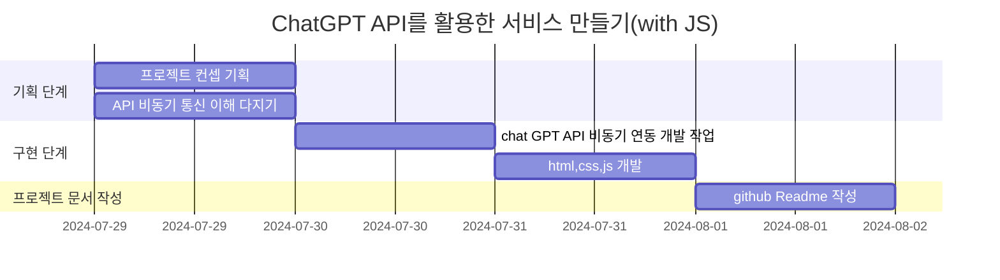

# chat_gpt_project 

  

## 프로젝트 일정

```mermaid
gantt
    title ChatGPT API를 활용한 서비스 만들기(with JS)
    dateFormat  YY-MM-DD

    section 기획 단계
    프로젝트 컨셉 기획 :2024-07-29, 1d
    API 비동기 통신 이해 다지기 :after,2024-07-29, 1d 

    section 구현 단계
    chat GPT API 비동기 연동 개발 작업 : 2024-07-30, 1d
    html,css,js 개발 : 2024-07-31, 1d

    section 프로젝트 문서 작성
    github Readme 작성 : 2024-08-01, 1d
```
