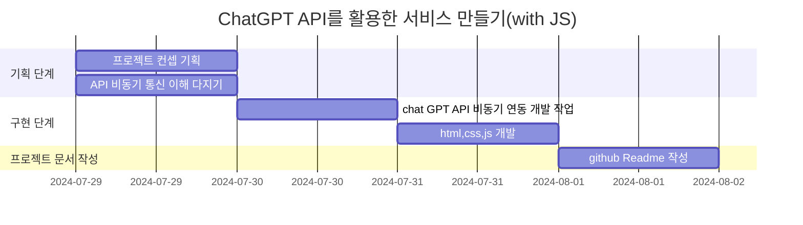

# Check My meal today - 내세끼🍙

  

하루 삼시세끼 정보로 ChatGPT가 섭취 영양소 밸런스를 체크  

## 개요
'내세끼'는 사용자에게 하루 섭취한 삼시세끼 식단 정보를 통해 현재 영양 상태를 체크해주고, 영양 밸런스를 위해 다음날 식단을 가이드 해주는 서비스입니다.

## 주요 기능
사용자에게 아침, 점심, 저녁 식단 정보를 받아 사전에 세팅해 둔 ChatGPT 응답 컨텐츠를 통하여  
섭취한 식단을 통한 영양 상태 체크 및 올바른 영양소 섭취를 위한 식단 추천을 제공합니다.

## 기획
1. main page : 사용자로부터 식단 정보 입력 받는 페이지
2. oading page : 분석 처리 대기 페이지
3. result page : 분석 결과 페이지  

## 프로젝트 일정

