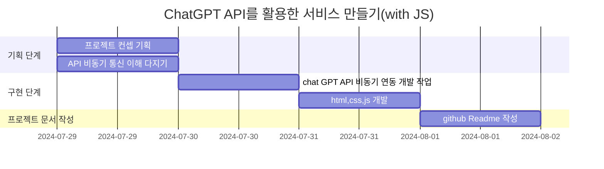

# Check My meal today - 내세끼🍙 


하루 삼시세끼 정보로 ChatGPT가 섭취 영양소 밸런스를 체크 <br>
 <br>
https://cheeou.github.io/chatGPT-project/checkMymeal/main.html
## 기술 스택
  

## 개요
'내세끼'는 사용자에게 하루 섭취한 삼시세끼 식단 정보를 통해 현재 영양 상태를 체크해주고, 영양 밸런스를 위해 다음날 식단을 가이드 해주는 서비스입니다.

## 주요 기능
사용자에게 아침, 점심, 저녁 식단 정보를 받아 사전에 세팅해 둔 ChatGPT 응답 컨텐츠를 통하여<br> 
섭취한 식단을 통한 영양 상태 체크 및 올바른 영양소 섭취를 위한 식단 추천을 제공합니다.

## 기획
1. main page : 사용자로부터 식단 정보 입력 받는 페이지
2. loading page : 분석 처리 대기 페이지
3. result page : 분석 결과 페이지 <br>


## 구현 화면
| 실행 화면 | 상세 설명 |
|-----------|------------|
|   | 사용자의 식단을 입력 받습니다.    |
|     | 분석중의 로딩화면 입니다.    |
|     | 입력된 식단 정보로 맞춤 정보를 제공합니다. 다시 분석하기 버튼으로 메인으로 돌아갑니다.   |

```
📦checkMymeal
 ┣ 📂asset
 ┃ ┣ 📜favicon.ico
 ┃ ┗ 📜style.css
 ┣ 📂img
 ┃ ┣ 📜loadingNego.gif
 ┃ ┣ 📜mm-background.png
 ┃ ┗ 📜mm-logo.png
 ┣ 📂script
 ┃ ┣ 📜result.js
 ┃ ┗ 📜script.js
 ┣ 📜checkMeal.html
 ┗ 📜result.html
```

## 프로젝트 일정



## 추후 보완할 기능 
1. 사용자 식단을 수집할 수 있는 DB 연동을 하여 장기적으로 섭취한 식단 데이터로 건강을 체크, 식단 가이드를 줄 수 있는 실질적인 정보를 제공하는 기능
2. 응답 데이터 형식이 조금씩 변형이 되는 케이스가 있는데, 세팅한 조건대로 일정한 데이터를 가져올 수 있도록 보완 필요
3. 모바일 반응형 적용

## 아쉬운 점
응답 받은 json 데이터가 마크다운 형식으로 전송이 되는데, 이 데이터를 html 구조화하여 css를 적용하려는 단계에서 챗지피티 도움을 받았는데, localStorage 방식으로 가이드를 받아 정규식으로 마크다운 표기 문자를 공백으로 처리를 하고 html 구조화한 방식이 너무 비효율적으로 구현한 것 같아 아쉬움이 있다. 이 부분은 추후에 더나은 방식으로 조사하여 리팩토링 해보아야겠다.

## 프로젝트를 진행하며 느낀점
주로 언어를 배울 때 기능 실습 위주, 클론 코딩을 해왔기 때문에 기획부터 구현까지 스스로 해낸 프로젝트는 이번 프로젝트가 처음인 것 같다. <br>
기획단계에서는 많은 아이디어들이 떠올랐지만, 어느새 ai 툴에 로직 구현을 의존하는 나를 발견하고(..) 현실적으로 내가 로직들을 능숙하게 구상하여서 접근하는 것이 어렵다고 생각하여 기본 기능에 충실한 서비스를 구현하였다. <br>
fetch, axio 통신 방식으로 chatgpt api 요청&응답을 구현해 볼 수 있었고, html,css,js 기능을 활용하는 경험이 되었다. 


